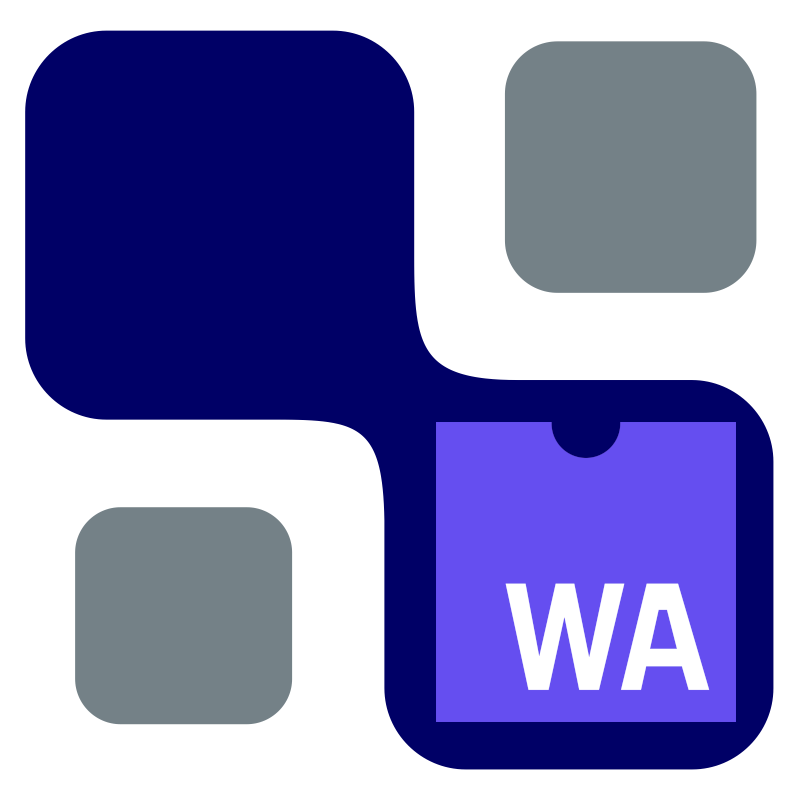

<a name="readme-top"></a>

<!-- PROJECT LOGO -->
<br />
<div align="center">
  <a href="https://github.com/othneildrew/Best-README-Template">
    
  </a>

  <h3 align="center">TVM Web Example</h3>

  <p align="center">
    A basic example of using TVM with WASM/WebGPU
    <br />
  </p>
</div>


<!-- ABOUT THE PROJECT -->
## About The Project

This is an example project for building a tvm webgpu-backed module and deploy it to the web.

Based on [@tqchen](https://github.com/tqchen)'s [TVM WebGPU example](https://github.com/tqchen/tvm-webgpu-example) from 2020, the project attempts to make environment setup easier, and to work with newer versions of TVM.

In its current state, a model can be loaded, but the TVM JS libraries are not named correctly.

<!-- GETTING STARTED -->
## Getting Started

The Docker container will set-up the TVM environment for you.
Build it with:

``` sh
docker build -t tvm_web-bonsapps_mwe:latest .
```


``` sh
docker run -v $(pwd):/workspace \
    -p  8000:8000 \
    -ti tvm_web-bonsapps_mwe:latest \
    bash -i

```

From inside the container
``` sh
export TVM_HOME=/tvm/
export PYTHONPATH=$TVM_HOME/python:${PYTHONPATH}
source "/root/emsdk/emsdk_env.sh"


cd /workspace/
# build the model
python3 build_tvm_wasm.py

```

Run the web-server (just opening the HTML file will not work because of CORS security)
``` sh
cd dist/
python3 -m http.server
```

<!-- ROADMAP -->
## Roadmap
- [x] get the Docker etc setup
- [x] update the TVM WebGPU example to work with newer versions of TVM
- [ ] fix `tvmjs" is not defined` error
- [ ] get a full model benchmarked
